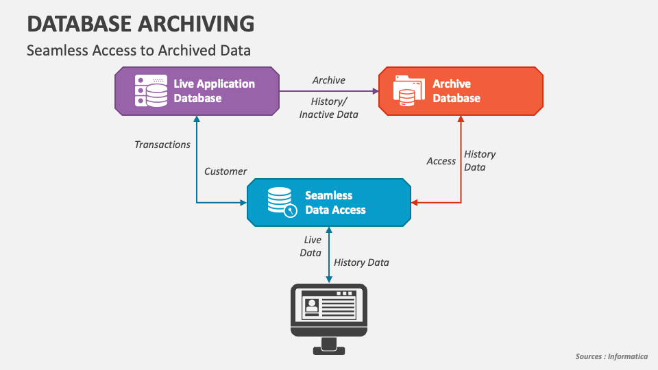

# 🌐 Web Development Hub – Kombee
---

  
    

---

## Welcome to our Web Development Center of Excellence!  With over a decade of experience delivering world-class web applications, we specialize in creating dynamic, scalable, and secure solutions tailored to meet diverse business needs.  
																																													  

### **[Frontend Development](https://roadmap.sh/frontend)** 🌐

            )     

### **[Backend Development](https://www.geeksforgeeks.org/backend-development/)** ⚡

                           

### **[Databases](https://www.geeksforgeeks.org/getting-started-with-database-management-system/)** 🗄️

            

  

---

## 🚀 Our Expertise  

We build dynamic web platforms designed to deliver exceptional user experiences, incorporating the latest trends and technologies to ensure speed, scalability, and security.  

---

### 💻 **Front-End Development** 

#### ⚛️ **React.js**
 - ♻️ Component-driven architecture for reusable and scalable UIs
 - ⚡ Optimized performance with:
   - 🔁 Hooks (useMemo, useCallback, etc.)
   - 💤 Lazy loading via React.lazy and Suspense
   - 🧠 Memoization with React.memo and useMemo
 - 🔄 State management options:
   - ⚙️ Context API for lightweight state sharing
   - 🧩 Redux for large-scale applications
   - 📦 MobX for observable state management
 - 💅 Seamless UI styling with:
   - 🎨 Tailwind CSS
   - 🧱 Material UI
   - 🧰 Bootstrap
 - 📱 Responsive design principles for mobile-first development

#### 🌐 **Next.js**
 - 🌍 Hybrid rendering with SSR (Server-Side Rendering) and SSG (Static Site Generation) for flexibility and performance
 - ⚡ Supports Incremental Static Regeneration (ISR) for real-time content updates without full rebuilds
 - 🚀 SEO-optimized architecture with:
   - 📄 Automatic head management via next/head
   - 🧭 Clean, file-based routing
 - 🔄 Full backend capabilities with:
   - ⚙️ API Routes for serverless functions
   - 🔐 Middleware for advanced request handling and auth
 - 🖼️ Built-in Image Optimization with lazy loading and responsive sizes
 - 🌐 Internationalization (i18n) and advanced dynamic routing
 - 📦 Smart code-splitting, caching, and bundle analysis for performance tuning

#### 🖌️ **Vue.js**
 - ✨ Lightweight and flexible framework suitable for small to enterprise-grade applications
 - 🔁 Two-way data binding for seamless synchronization between UI and state
 - ⚙️ Component-based architecture with scoped styles and templating
 - ⚡ Reactive system powered by the Composition API and Reactivity Core
 - 🔄 Scalable state management using:
   - 🧠 Vuex for centralized, predictable state control
   - ⚡ Pinia for a modern, intuitive alternative with full TypeScript support
 - 📦 Integrated support for tools like Vite and Vue CLI for fast builds
 - 💅 Smooth integration with UI libraries like Vuetify, Tailwind CSS, and BootstrapVue

#### 🚀 **Nuxt.js**
 - 🧙 Out-of-the-box support for SSR (Server-Side Rendering), SSG (Static Site Generation), and hybrid rendering modes
 - 🧩 Seamless integration with Vue.js, featuring:
   - 🔁 Auto-imported pages and components
   - 🧱 Layout system for structured UI composition
   - ⚙️ File-based routing with dynamic and nested routes
 - 💨 Optimized for performance and scalability with:
   - 🔄 Smart code-splitting and caching
   - 🚀 Pre-rendering and lazy loading capabilities
 - 🔍 Built-in SEO tools including dynamic meta tags and sitemap generation
 - 📦 Rich ecosystem of Nuxt modules for PWA, auth, i18n, analytics, and more
 - 🛠️ Developer-friendly DX with powerful CLI, hot reload, and TypeScript support

#### 🏗️ **Angular**
 - 🏢 Enterprise-grade framework with full TypeScript support
 - 🧩 Modular and scalable project architecture
 - 🔁 Built-in dependency injection system
 - ⚙️ CLI tools for fast scaffolding and testing
 - 🔄 Advanced form handling, RxJS-powered state management, and routing

#### 🔥 **Svelte**
 - ⚡ Compiles to highly optimized vanilla JavaScript
 - 🔄 Native reactivity with no virtual DOM overhead
 - ✨ Simple, elegant syntax with rapid development experience
 - 📦 Lightweight bundles and fast load times

#### ⚡ **Solid.js**
 - ⚡ Fine-grained reactivity with direct DOM updates
 - 🧠 No virtual DOM—updates only what’s needed
 - 🧩 JSX-based syntax similar to React
 - 🚀 Unmatched performance and small bundle sizes

#### 🧬 **Qwik**
 - 🌐 Resumable framework optimized for instant-loading web apps
 - 💧 Fine-grained lazy loading (down to the component level)
 - 🧠 Intelligent hydration for minimal JS execution
 - 🚀 Ideal for large, interactive apps at web scale

#### 📦 **Other Notable Frameworks & Libraries**
 - Alpine.js
   - 💡 Lightweight and reactive JavaScript framework for UI interactions
   - ⚙️ Ideal for small enhancements in static sites
 - Preact
   - ⚛️ 3KB React alternative with a similar API
   - ⚡ Extremely fast rendering and minimal bundle size
 - Lit
   - 🔁 Simple and efficient way to build web components
   - 💡 Works seamlessly with any framework
 - Stencil.js
   - 🧱 Web component compiler for framework-agnostic UI libraries
   - ⚙️ Used by large-scale design systems
 - Gatsby.js
   - ⚡ React-based static site generator
   - 🌐 Great for SEO, fast builds with GraphQL data sourcing

																

---

### 💻 **Back-End Development**  

#### **Laravel**

- ⚡ Rapid application development with Laravel's elegant syntax  
- 🔄 Advanced state management and application architecture  
- 🛠️ Expertise in Laravel's ecosystem:
  - 🔒 **Laravel Sanctum** – API authentication  
  - 🔑 **Laravel Passport** – OAuth2 server implementation  
  - 📅 **Laravel Scheduler** – Task scheduling  
  - 👮 **Laravel Policies** – Fine-grained authorization  
  - 📬 **Laravel Notifications** – Multi-channel alert system  
  - 🗃️ **Laravel Migrations** – Version-controlled database changes  
  - 🔍 **Laravel Scout** – Full-text search engine  
  - 🗄️ **Laravel Eloquent ORM** – Elegant database interaction  
  - ⚡ **Laravel Octane** – High-performance Laravel runtime  
  - 🔄 **Laravel Horizon** – Queue management and monitoring

- 🏗️ Robust architectural patterns with **Domain-Driven Design**

- 🎨 **API Design Excellence**:
  - 🔄 RESTful API best practices  
  - 🌐 GraphQL implementations with **Lighthouse**  
  - 📚 Comprehensive documentation using **Postman**

- ⚡ **Real-Time Applications**:
  - 🔄 WebSocket integrations with **Laravel Echo** and **Pusher**  
  - 📊 Real-time dashboards and live monitoring  
  - 💬 Chat applications and instant notification systems  
  - 🔧 Event-driven architecture

#### **Node.js**

- ⚡ Efficient, non-blocking I/O with asynchronous programming  
- 🔄 RESTful API development using **Express.js**  
- 🔐 Secure authentication and authorization mechanisms  

#### **Databases**

- 💾 Expert database design and performance optimization  
- 🔄 Multi-database support:
  - 📊 **MySQL** – Traditional relational data  
  - 🗄️ **PostgreSQL** – Advanced relational capabilities  
  - 📁 **MongoDB** – Flexible document-based storage  
  - 🔑 **Redis** – In-memory caching and real-time features  
- ⚡ Query tuning and indexing strategies  
- 🔍 Full-text search integration with **Elasticsearch**

#### 🖼️ **Database Architectures**

  
  
  
  

---

### 📊 **Content Management Systems**  

- **Sanity CMS**  
  - 📋 Schema-first approach for structured content  
  - 🚀 Real-time editing and collaborative workflows  

- **WordPress**  
  - ⚙️ Easy-to-use platform for blogs and websites  

---

### 🌟 **Other Capabilities**  

- 💡 Progressive Web Apps (PWAs) for a native-like experience  
- 🔌 Integration with third-party APIs and services  
- 📈 Performance optimization and caching strategies  
- ⚙️ Automation with CI/CD pipelines  

---

## 💡 **Development Process**

Our development process adheres to industry best practices to ensure maintainability, scalability, quality, security and optimal performance in every project. We leverage **Clean Architecture** and **Domain-Driven Design** principles for all applications, enabling modular and testable codebases.

### 🏛️ Key Pillars of Our Process

---

#### 1. 📋 **Requirement Analysis & Planning**

- 🤝 Collaborate with stakeholders to gather detailed requirements  
- 📝 Define API contracts and system boundaries  
- 🔍 Identify technology stack and infrastructure needs  
- 🔒 Define security requirements and compliance standards  

#### 2. 🏗️ **Architecture Design**

- 🔄 Implementation of **Clean Architecture** principles:
  - 🎨 **API Layer** – RESTful or GraphQL endpoints  
  - 🧠 **Domain Layer** – Core business logic and models  
  - 💾 **Data Layer** – Repositories and data access strategies  
  - 🔄 **Infrastructure Layer** – Integrations with external services  
- ✨ Emphasis on flexibility, maintainability, and testability  
- ⚡ Performance optimization and security by design  

#### 3. 🔄 **Agile Development & Iteration**

- 🏃‍♂️ Sprint-based delivery with regular stakeholder demos  
- 🔄 CI/CD pipelines for seamless integration and deployment  
- 👀 Code reviews and static analysis for high code quality  
- 🛡️ Continuous security audits and vulnerability checks  

#### 4. 🧪 **Testing & Quality Assurance**

- ✅ Unit, integration, and API testing with **PHPUnit** and **Pest**  
- ⚡ Performance/load testing using **K6** and **JMeter**  
- 🔒 Security testing via **OWASP ZAP** and **Snyk**  
- 📊 Code coverage reports and quality metrics tracking  

#### 5. 🚀 **Deployment & Infrastructure**

- 📦 Containerization using **Docker** and orchestration via **Kubernetes**  
- ☁️ Cloud deployments on **AWS**, **Azure**, or **Google Cloud Platform**  
- 🔄 Infrastructure as Code with **Terraform** and **Ansible**  
- 📊 Monitoring and observability with **Prometheus** and **Grafana**  

#### 6. 🛡️ **Maintenance & Support**

- 📊 Ongoing performance monitoring and tuning  
- 🔄 Scheduled updates and critical patch management  
- 🔍 Proactive detection and resolution of issues  
- 🚀 Scalable solutions to support growing application needs  

---

## 🌟 **Why Choose Us?**

- ✅ Proven expertise in delivering robust and scalable Laravel applications
- 🔄 End-to-end development from architecture to deployment
- 📈 Commitment to adopting best practices and latest technologies
- 🎯 Tailored solutions for businesses of all sizes and industries
- 🔒 Focus on security, performance, and reliability

---

## 🛠️ **Tools & Technologies**  

- IDEs: Visual Studio Code, WebStorm, Cursor
- Version Control: Git, GitHub, GitLab  
- CI/CD: Jenkins, GitHub Actions, Azure Pipelines  
- Cloud: AWS, Azure, Vercel, Netlify  

---

## 🌍 **Live Projects & Demos**  

## 💻 **Front-End Development**

1. **ReactJs**
- [Kiwi Explorer Map](https://github.com/Web-Dev-Kombee/kiwi-explorer-map) 
- [Daily Micro Learning](https://github.com/Web-Dev-Kombbe/daily-micro-learning) 
- [Plinkoo Game](https://github.com/Web-Dev-Kombee/plinkoo-game)
- [Food Receipe](https://github.com/Web-Dev-Kombee/Food-Receipe)
- [Todo App](https://github.com/Web-Dev-Kombee/todo-app)
- [Task Manager](https://github.com/Web-Dev-Kombee/task-manager)  

---

## 💻 **Back-End Development**

1. **Laravel**
  - [Book Lending System](https://github.com/Web-Dev-Kombee/Book-Lending-System)
  - [Bus Ticketing System](https://github.com/Web-Dev-Kombee/Bus-Ticketing-System)
  - [Clean Architecture](https://github.com/Web-Dev-Kombee/Clean-Architecture-Laravel)
  - [Realtime Chat](https://github.com/Web-Dev-Kombee/Laravel-Reverb-Realtime-Chat)
  - [Domain Driven Design](https://github.com/Web-Dev-Kombee/Laravel-Domain-Driven-Design)

	
2. **.NET**
  - [Geotracker](https://github.com/Web-Dev-Kombee/GeoTracker-)
  - [CQRSDemo](https://github.com/Web-Dev-Kombee/CQRSDemo)
  - [EBookDemo](https://github.com/Web-Dev-Kombee/Dotnet-EBookDemo)
  - [Bookly](https://github.com/Web-Dev-Kombee/Bookly)
	
															   
														  
																   
													  
---
  

## 🌐 **Let’s Connect**

We’re excited to collaborate and bring your ideas to life!

- **Website**: [www.kombee.com/in](https://www.kombee.com/in)
- **Email**: contact@kombee.com
- **LinkedIn**: [Kombee Technologies](https://in.linkedin.com/company/kombee-global)
- **Twitter**: [@KombeeTech](https://twitter.com/KombeeTech)
